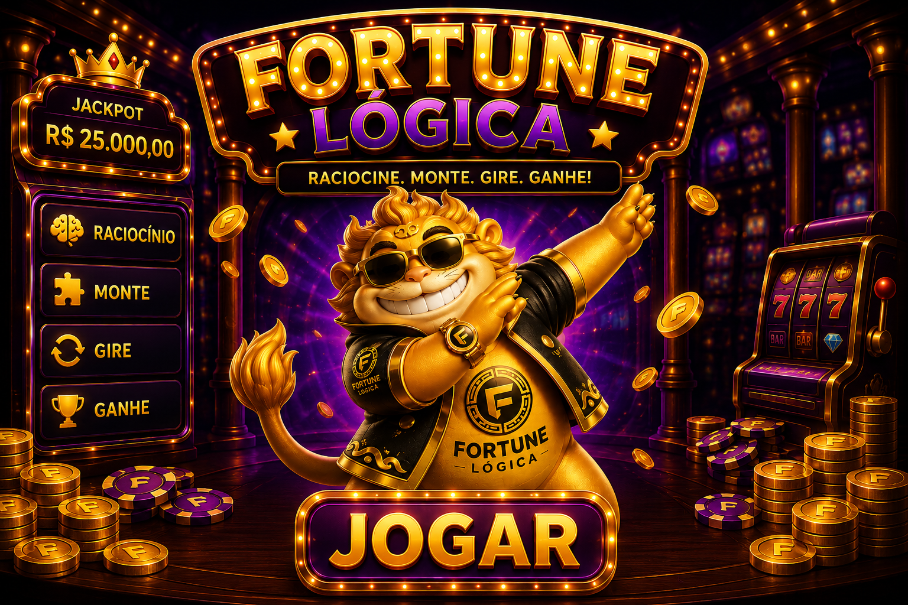

# Fortune Logica



## Ideia do Jogo

Fortune Logica e um jogo educativo que mistura caca-niquel com logica proposicional.

A ideia e simples: o jogador monta uma frase logica, aposta moedas e gira os rolos. Depois o jogo sorteia se cada proposicao e verdadeira ou falsa. Se a frase logica final der verdadeira, o jogador ganha. Se der falsa, perde.

Exemplo de expressao:

```text
A E B
```

Essa expressao so da verdadeiro se `A` for verdadeiro e `B` tambem for verdadeiro.


## Como Jogar

1. Escolha a quantidade de premissas.
2. Monte a expressao usando os conectores logicos.
3. Escolha o valor da aposta.
4. Clique em `GIRAR`.
5. O jogo sorteia `V` ou `F` para cada premissa.
6. Se a expressao final for verdadeira, o jogador ganha moedas.
7. Se for falsa, o jogador perde a aposta.

## Conectores Logicos Usados

O jogo usa estes conectores:

| Conector | Significado | Exemplo |
| --- | --- | --- |
| `E` | As duas partes precisam ser verdadeiras | `A E B` |
| `OU` | Pelo menos uma parte precisa ser verdadeira | `A OU B` |
| `SE` | Condicional: se A, entao B | `A SE B` |
| `SSE` | Bicondicional: A e B precisam ter o mesmo valor | `A SSE B` |
| `NAO` | Inverte o valor da premissa | `NAO A` |

## Onde Isso Aparece no Codigo

No arquivo `funcoes/interface_pygame.py`, os conectores ficam definidos assim:

```python
OPERADORES = ("E", "OU", "SE", "SSE")
```

Essa parte diz quais operadores o jogador pode escolher nos slots.

A funcao `analisar_tokens` verifica se a expressao esta montada na ordem correta. Por exemplo, ela impede uma expressao errada como:

```text
A E OU B
```

Depois disso, a expressao vai para `funcoes/logica.py`, que calcula se ela e verdadeira ou falsa.

## Funcoes dos Conectores Logicos

A parte mais importante da logica fica no arquivo `funcoes/logica.py`, dentro da funcao `aplicar_operador`.

Essa funcao recebe:

- `operador`: qual conector foi escolhido, por exemplo `E`, `OU`, `SE` ou `SSE`.
- `esquerda`: o valor da primeira parte da expressao.
- `direita`: o valor da segunda parte da expressao.

Trecho simplificado do codigo:

```python
def aplicar_operador(operador, esquerda, direita):
    if operador == "E":
        return esquerda and direita

    if operador == "OU":
        return esquerda or direita

    if operador == "SE":
        return (not esquerda) or direita

    if operador == "SSE":
        return esquerda == direita

    raise ValueError(f"Operador invalido: {operador}")
```

Explicando de forma simples:

| Operador | Trecho do codigo | O que significa |
| --- | --- | --- |
| `E` | `return esquerda and direita` | So ganha se os dois lados forem verdadeiros |
| `OU` | `return esquerda or direita` | Ganha se pelo menos um lado for verdadeiro |
| `SE` | `return (not esquerda) or direita` | Representa "se esquerda, entao direita" |
| `SSE` | `return esquerda == direita` | Ganha se os dois lados tiverem o mesmo valor |

### Funcao do NAO

O `NAO` tambem fica em `funcoes/logica.py`:

```python
def aplicar_nao(valor):
    return not valor
```

Ele simplesmente inverte o valor:

| Valor original | Depois do `NAO` |
| --- | --- |
| Verdadeiro | Falso |
| Falso | Verdadeiro |

## Onde Fica Cada Parte do Projeto

| Arquivo | Funcao no projeto |
| --- | --- |
| `fortune_logica.py` | Inicia o jogo |
| `funcoes/interface_pygame.py` | Tela, botoes, sons, animacoes e tela cheia |
| `funcoes/logica.py` | Regras de logica, chance, multiplicador e jackpot |
| `funcoes/saldo.py` | Salva e carrega o saldo do jogador |
| `funcoes/constantes.py` | Guarda as premissas usadas no jogo |
| `assets/` | Imagens, GIFs e sons |

## Como Rodar

Instale as dependencias:

```bash
pip install -r requirements.txt
```

Rode o jogo:

```bash
python -m funcoes.interface_pygame
```

## Controles

- Clique nos operadores para trocar entre `E`, `OU`, `SE` e `SSE`.
- Clique nas premissas para colocar ou tirar `NAO`.
- Use `F11` ou `Alt+Enter` para tela cheia.
- Clique em `GIRAR` para iniciar a rodada.

## O Que Foi Usado

- Python
- Pygame, para tela, imagens, sons e animacoes
- Pillow, para carregar o GIF do mascote
- PNG, GIF e MP3 na pasta `assets/`
- `unittest` para testar a logica

## Arte

A arte do jogo esta na pasta `assets/`. Ela inclui:

- fundo do jogo
- caca-niquel
- botao de girar
- icones dos conectores logicos
- mascote parado
- mascote animado
- efeitos sonoros

## Testes

Para rodar os testes:

```bash
python -m unittest
```

## Integrantes

- João Mafra
- Vinicius Cezar
- Marcelo Fonseca
- Luiz Vieira
- Eduardo Esteves
- Márcio Rodriguez
